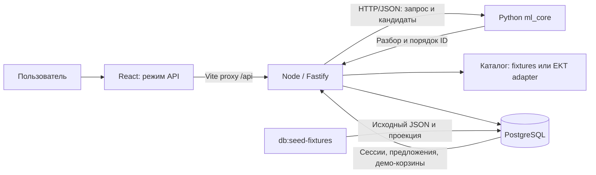

# ЭКТ Ассистент — demo-MVP для HackAlem AI

Помощник для покупателей и специалистов по закупке электротехнических товаров: помогает найти позицию по артикулу или текстовому запросу, изучить доступные характеристики и подготовить добавление в корзину. Цель проекта — сократить ручной поиск и сделать проверку товара перед покупкой прозрачной.

В репозитории объединены React-интерфейс, Node.js backend, Python-сервис разбора запросов и PostgreSQL. Рабочий сценарий использует **снимки каталога и отдельную демо-корзину**. Записи в корзину магазина EKT, оформления заказа и резервирования товара нет.

## Что реализовано

| Возможность | Текущее поведение |
| --- | --- |
| Поиск | По ID, точному артикулу и тексту; сохраняет ведущие нули и подчёркивания. При запросе по типу и току Node проверяет ограничения по данным каталога. |
| Карточка товара | Название, артикулы, опубликованная цена, доступные складские данные, источник и предупреждения о противоречиях. Неизвестные значения остаются неизвестными. |
| Чат | Node принимает запрос, Python разбирает текст и ранжирует переданные кандидаты. При недоступном Python работает локальный поиск. |
| Предложение покупки | Сервер создаёт предложение с условиями и версией корзины. Корзина до отдельного подтверждения не меняется. |
| Подтверждение | Node проверяет сессию, CSRF, актуальность предложения и товарные условия; повтор того же подтверждения не удваивает количество. |
| Отмена | Кнопка вызывает серверный cancel endpoint; успех показывается после ответа сервера. |
| Корзина | Хранится в PostgreSQL, привязана к cookie-сессии и доступна после обновления страницы. Чужая сессия не может подтвердить предложение. |
| Диагностика | Health endpoint, OpenAPI, единый формат ошибок и автоматические проверки. |

**Языковая модель пока не подключена.** Текущий Python HTTP-сервис использует правила, регулярные выражения и текстовое ранжирование `difflib`; Node формирует шаблонные ответы. Готового провайдера OpenAI или NVIDIA в текущем коде нет. `ml_status=ok` подтверждает успешный ответ Python, а не вызов LLM. Поддерживается `AI_MODE=stub`; значение `openai` явно отклоняется при запуске.

В интерфейсе есть два режима: `API` для работы с Node и отдельное локальное `Демо` с подготовленными примерами. Примеры аналогов, доставки и обработки файлов в локальном режиме не подтверждают наличие этих интеграций в backend.

## Как работает решение

1. Пользователь выбирает режим **API** и вводит артикул или запрос, например «Нужен автомат на 16 А».
2. Frontend обращается к Node через Vite proxy. Node получает кандидатов из каталога и может передать их Python для ранжирования.
3. Node проверяет ограничения исходного запроса и возвращает факты только из каталога. Ответ Python не может подменить цену, остаток или разрешить покупку.
4. Пользователь выбирает товар и количество. Сервер создаёт предложение; корзина остаётся прежней.
5. После явного подтверждения Node повторно проверяет условия и атомарно добавляет товар в демо-корзину.
6. Пользователь открывает `/#/cart`. После reload остаётся та же серверная корзина. Отмена предложения запрещает его последующее подтверждение.

`POST /api/chat` сам по себе не изменяет корзину. Python не получает cookie, CSRF-токен и право подтверждать предложения.

## Технологии и архитектура

- **Backend:** Node.js 24 LTS, TypeScript strict, Fastify, Zod, PostgreSQL (`pg`), SQL-миграции, OpenAPI.
- **Frontend:** React 19, TypeScript, Vite 6, Lucide React.
- **Python:** Python 3.12, HTTP-сервис на стандартной библиотеке, `re`, `difflib`, `python-dotenv`.
- **Проверки:** Vitest, ESLint для backend, TypeScript, pytest, Playwright/Chromium.
- **Организация:** npm workspaces для backend; frontend устанавливается отдельно. В репозитории есть Docker Compose, описанный ниже проверенный запуск обходится без Docker.



Node остаётся источником решений о покупке. Режимы каталога (`CATALOG_MODE`), корзины (`CART_MODE`) и AI (`AI_MODE`) независимы. Ошибка live-каталога не включает fixtures автоматически.

```text
apps/api/          Node API, каталог, корзина, ML-клиент и тесты
front/             интерфейс, API-адаптер и браузерные тесты
ml_core/           Python-код и HTTP-сервис
tests/             Python-тесты
samples/           исходные снимки и отдельные synthetic-данные
docs/              требования, планы и контракты команды
```

Подробные схемы: [API_CONTRACT.md](docs/API_CONTRACT.md), [ML_CORE_CONTRACT.md](docs/ML_CORE_CONTRACT.md). Машинная схема работающего Node: `GET /api/openapi.json`.

## Установка и запуск без Docker

Проверено локально на Windows, Node.js **24.21.0**, Python **3.12.14** и PostgreSQL **18**. Нужны установленный PostgreSQL и три терминала. Команды ниже — для PowerShell; если запуск `npm.ps1` запрещён политикой системы, используйте `npm.cmd` вместо `npm`.

### 1. Подготовить базу и Node

В pgAdmin создайте базу `ekt_assistant`. Host, port и username доступны в свойствах подключения сервера, на вкладке Connection.

Из корня репозитория:

```powershell
npm ci
if (!(Test-Path .env)) { Copy-Item .env.example .env }
```

Задайте в **локальном корневом `.env`**:

```dotenv
CATALOG_MODE=fixture
CART_MODE=demo
AI_MODE=stub
PORT=8000
DATABASE_URL=postgresql://<local-user>@127.0.0.1:5432/ekt_assistant
ML_CORE_URL=http://127.0.0.1:8100
ALLOWED_ORIGIN=http://127.0.0.1:5173
```

Замените `<local-user>` на локального пользователя PostgreSQL. Если подключение требует пароль, задайте его только локально в URL с корректным URL-кодированием или в окружении процесса. `.env` исключён из Git. Для этого fixture-сценария ключи EKT, OpenAI и NVIDIA не нужны.

```powershell
npm run db:migrate
npm run db:seed-fixtures
npm run dev:api
```

Node читает корневой `.env`. Health: [http://127.0.0.1:8000/api/health](http://127.0.0.1:8000/api/health). Оставьте процесс работающим.

### 2. Запустить Python

В отдельном терминале, из корня:

```powershell
python -m venv .venv
.\.venv\Scripts\python.exe -m pip install -r requirements.txt pytest
.\.venv\Scripts\python.exe -m ml_core.service
```

Сервис по умолчанию слушает `127.0.0.1:8100`. На Linux/macOS путь к Python в виртуальном окружении — `.venv/bin/python`. Без `ML_CORE_URL` Node использует локальный поиск; для полного сценария с Python переменная должна быть задана.

### 3. Запустить frontend

В третьем терминале, из корня:

```powershell
cd front
npm ci
npm run build
npm run preview
```

Откройте **[http://127.0.0.1:5173](http://127.0.0.1:5173)** и выберите режим **API** в верхней панели. Это существенно: локальное «Демо» использует другие данные и не проверяет backend.

Для разработки вместо preview можно выполнить `npm run dev`. Обе команды используют строго порт **5173**; при занятом порте завершаются с ошибкой. Не запускайте их одновременно. Vite проксирует `/api` на Node `127.0.0.1:8000`; `ALLOWED_ORIGIN` должен совпадать с адресом браузера, включая host и port. Для приведённых команд используйте `127.0.0.1`, а не `localhost`.

## Сценарий для жюри

Начните в новом приватном окне браузера, чтобы получить пустую сессию. Все шаги выполняются в режиме **API**.

1. Введите **`027228`**. Откройте карточку **515291**: внутренний артикул `200300285_`, артикул поставщика `027228`. Видно предупреждение **SPEC_CONFLICT**: в названии/описании указано 160 А, в свойстве — 250 А.
2. В карточке опубликована цена **64920** с пояснением об неизвестной валюте. Покупка этой позиции недоступна: подтверждённых правил продажи нет.
3. Введите **«Нужен автомат Legrand на 160 А»**. На текущих данных система сообщает об отсутствии подтверждённого совпадения; автомат на 80 А не выдаётся как подходящий.
4. Введите **`DEMO_001`** или **«Нужен автомат на 16 А»**. Выберите синтетический товар **900000001** — он специально подготовлен для проверки корзины.
5. Создайте предложение добавления. **До подтверждения корзина пуста.** Одно слово «да» в чате не подтверждает покупку; используйте кнопку явного подтверждения.
6. Подтвердите, откройте корзину `/#/cart` и обновите страницу. Позиция остаётся в той же серверной корзине.
7. Создайте ещё одно предложение и нажмите «Отмена». Успех появляется после ответа сервера; количество в корзине не меняется.
8. Откройте вторую вкладку того же браузера и включите API. Подтверждение в первой вкладке продолжает работать после однократного обновления устаревшего CSRF-токена.

Повтор одного confirm с тем же `Idempotency-Key`, запрет позднего confirm после отмены и защита чужой сессии проверяются автоматическими тестами. Отдельная проверочная страница Node — `http://127.0.0.1:8000/cart`.

## Проверки и фактические результаты

Из корня:

```powershell
npm run lint
npm run typecheck
npm test
npm run build
.\.venv\Scripts\python.exe -m pytest
```

Для PostgreSQL-тестов создайте **отдельную** базу `ekt_demo_mvp_test`, примените к ней миграции и задайте `TEST_DATABASE_URL` в окружении тестового процесса. Не используйте рабочую базу: тесты создают сессии, предложения и корзины.

```powershell
$env:TEST_DATABASE_URL = 'postgresql://<local-user>@127.0.0.1:5432/ekt_demo_mvp_test'
$env:DATABASE_URL = $env:TEST_DATABASE_URL
npm run db:migrate
Remove-Item Env:DATABASE_URL
npm run test:integration
```

Frontend, из каталога `front`:

```powershell
npm test
npm run build
npx playwright install chromium
# Node, Python и frontend preview уже должны быть запущены:
$env:E2E_EXTERNAL = '1'
$env:E2E_API = '1'
npx playwright test e2e/api-integration.spec.ts
```

Фактический финальный прогон:

| Проверка | Результат |
| --- | --- |
| Backend lint, typecheck, build | Пройдены |
| Backend Vitest без внешних ключей | 14 пройдены; 2 DB-теста пропущены в этом запуске |
| PostgreSQL integration в отдельной базе | 2 пройдены |
| Python pytest | 23 пройдены, дополнительно 5 subtests |
| Frontend unit | 17 пройдены |
| Frontend build, включая TypeScript | Пройден |
| Playwright: основной UI и редактирование локального демо | 6 пройдены |
| Playwright API: реальные frontend + Node + Python + PostgreSQL | 4 пройдены |

Четыре API-теста проверяют полный путь до корзины и reload, отсутствие изменений до confirm, отсутствие удвоения при повторе, ограничения поиска и `ml_status=ok`, серверную отмену и две вкладки с CSRF. Сессия создаётся через настоящий Vite proxy. Frontend mock-режим в этих четырёх тестах не используется.

У frontend нет отдельного lint script; TypeScript проверяется сборкой. В проверочной Windows-среде автоматическое завершение preview из Playwright зависало, поэтому API-тесты выполнены с отдельно запущенным preview и `E2E_EXTERNAL=1`. Live EKT, внешние LLM и публичное размещение не проверялись.

## Данные и интеграции

- `samples/` содержит предоставленные снимки EKT: страницу из 20 позиций и detail-карточку. Это **не текущие данные сервера** и не полный каталог; `count=20` не считается его размером.
- `samples/synthetic/demo-products.json` содержит отдельный тестовый товар с `source=synthetic`, демо-ценой, единицей продажи и остатком. Только для него подтверждены условия текущего сценария покупки.
- Команда `db:seed-fixtures` сохраняет исходный JSON отдельно от нормализованной проекции PostgreSQL. Во время работы fixture-каталог читает `samples/`; автоматической записи live-ответов в БД нет. Артикулы остаются строками; отсутствующий `quantity` не превращается в нулевой остаток.
- У 515291 сохранены оба значения тока и их источники. `RECOMMEND` не трактуется как доказанный список аналогов.
- В Node есть `EktCatalogProvider` для `CATALOG_MODE=live`. Он требует серверные `EKT_API_USER` и `EKT_API_PASSWORD`; live-подключение в этом прогоне не проверялось. Отдельный Python-клиент каталога читает `EKT_API_PASS`; он не участвует в описанном HTTP-пути ранжирования.
- Python работает по [HTTP/JSON-контракту](docs/ML_CORE_CONTRACT.md). Недоступность Python не блокирует обычный поиск товаров.

Ключи и пароли задаются только в локальном серверном окружении. Они не нужны frontend и не должны попадать в Git.

## Ограничения текущей версии

- Полноценного LLM-консультанта, подключённых OpenAI/NVIDIA, embeddings и семантического поиска нет.
- Поиск использует ограниченные правила и доступную часть каталога. Совпадение типа и тока не является инженерной гарантией совместимости; при недостаточных данных система не обещает подбор.
- Реальная корзина EKT не интегрирована: `CART_MODE=ekt` возвращает `INTEGRATION_NOT_CONFIGURED`. Демо-корзина не резервирует товар, не принимает оплату и не оформляет заказ.
- Не подтверждены валюта, единицы и правила продажи EKT, назначение складов, условия доставки/оплаты, сертификаты и аналоги. Backend их не выдумывает.
- В API-режиме добавляется только подготовленный synthetic-товар; изменение и удаление строк корзины через frontend API пока отключены.
- Серверная обработка пользовательских вложений, OCR и полноценная авторизация покупателей не реализованы.

## Размещение

Подтверждённой ссылки на deployed-версию в репозитории нет. Проверенный адрес локального демо — [http://127.0.0.1:5173](http://127.0.0.1:5173).

В `front/netlify.toml` есть настройки статического frontend, но они не разворачивают Node, Python и PostgreSQL. Vite proxy относится к локальному dev/preview; для публичного API-сценария потребуется отдельная серверная конфигурация. В рамках финальной проверки deploy не выполнялся.
